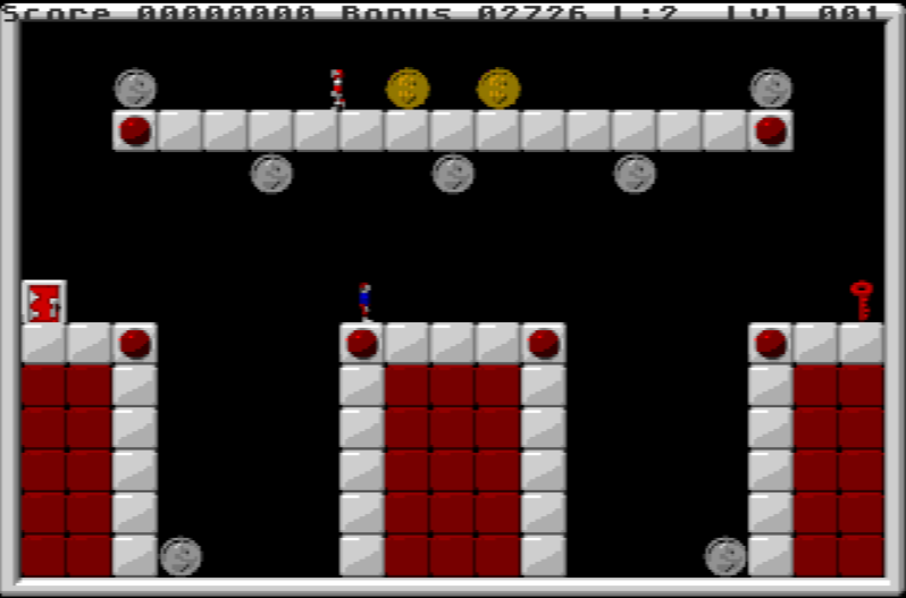

# SOI_MD

SOI_MD is a recreation of the 90s MacOS game [Step On It!](https://en.wikipedia.org/wiki/Step_on_It!_(video_game)) by [Cassady and Greene](https://en.wikipedia.org/wiki/Casady_%26_Greene), for the [Sega MegaDrive](https://en.wikipedia.org/wiki/Sega_Genesis) console.

It was made a reality thanks to the [SGDK](https://github.com/Stephane-D/SGDK) framework by [Stephane-D](https://github.com/Stephane-D) .

Original:


SOI_MD:



This repo crams the original game into the color and display capabilities of the [Sega MegaDrive](https://en.wikipedia.org/wiki/Sega_Genesis), and implements the same gameplay to be performed on the MegaDrive controller, from scratch.

## Playing

[The Releases page](https://github.com/elgambitero/SOI_MD/releases) of this repo contains playable .bin rom files. The roms are ready to be executed on original hardware, or on an emulator. The emulator used during development is [blastem](https://www.retrodev.com/blastem/), choosen for it's focus on accuracy.

## Compiling

This code is currently compiled using a frozen version of [kubilus1](https://github.com/kubilus1) 's packaging of SGDK for Linux, [GENDEV](https://github.com/kubilus1/gendev).

For easiness of use, [GENDEV](https://github.com/kubilus1/gendev) was packaged by [kubilus1](https://github.com/kubilus1) into a [Docker Image](https://hub.docker.com/r/kubilus1/gendev). This repo uses a frozen version of that container, [gvjaime/gendev](https://hub.docker.com/r/gvjaime/gendev). The compiling command would be then
```
bash ./scripts/build.sh
```

And the output of the compilation should appear in the `out/` folder, with `rom.bin` as filename.
