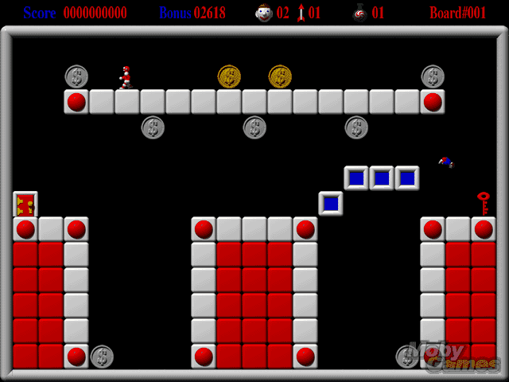

# SOI_MD

SOI_MD is a recreation of the 90s MacOS game [Step On It!](https://en.wikipedia.org/wiki/Step_on_It!_(video_game)) by [Cassady and Greene](https://en.wikipedia.org/wiki/Casady_%26_Greene), for the [Sega MegaDrive](https://en.wikipedia.org/wiki/Sega_Genesis) console.

It was made a reality thanks to the [SGDK](https://github.com/Stephane-D/SGDK) framework by @Stephane-D .

